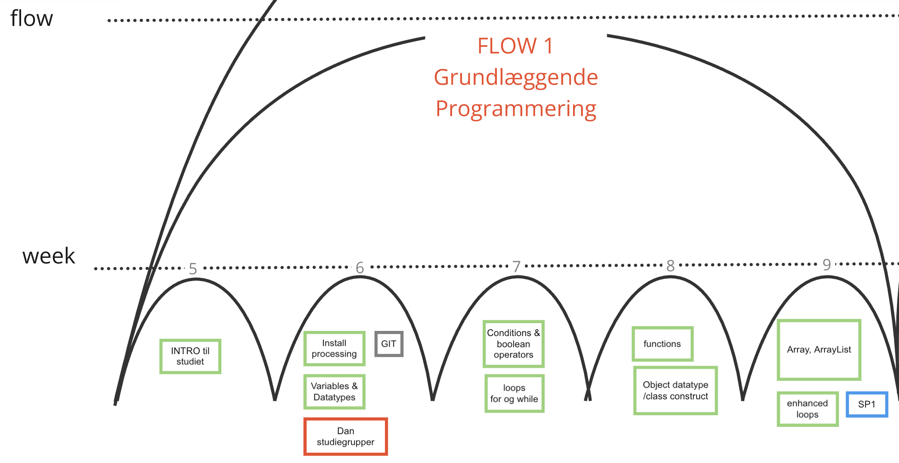

# Flow1 - Grundlæggende Programmering

Flow 1 strækker sig over 4 uger. 
Her får du lært programmeringens helt basale elementer. 
Det er nogle intensive uger hvor vi skal igennem rigtig meget, og der lægges nye ting på ved hver undervisningsgang. 
Aktiv deltagelse er strengt nødvendigt, og hvis du bliver forhindret, er det vigtigt at få fulgt op. 
Alle de følgende flows bygger på det I lærer i dette flow. 
Flowet har afleveringer hver uge og afsluttes med et større frit projekt hvor du bruger de ting du har lært(SP1).