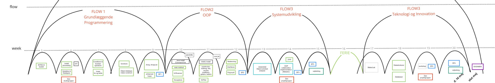

# DAT 1. semester

Velkommen til dat1's gitHub sider. Her finder du detaljer om det faglige indhold, hvordan du skal forberede dig inden en lektion, samt links til artikler og videomateriale.

Alt det praktiske finder du på Moodle. Der kan du se tid/sted for undervisningen, aflevere dine opgaver, registrere grupper, se nyheder fra din underviser og finde kontaktinformation.

Brug menuen til venstre, eller start fra flowplanen i Moodle hvor der linkes direkte til den aktuelle uge.

<!--
## Kursusmaterialer

1. [GP - Intro til programmering: Variable og Datatyper](./intro_to_programming)
2. [GP - Kontrolstrukturer: Betingelse og Loops](./control_structures)
3. [GP - Organisering af kode: Funktioner og Objekter ](./organising_code)
4. [GP - Lister: array[] og ArrayList (SP1)](./lists)
5. [OOP - Java_CLI_Scanner](./Java_CLI_Scanner)
6. [OOP - Java_IntelliJ-File](./IntelliJ-File)
7. [OOP - Nedarvning, Interfaces, Polymorphi (SP2)](./inheritance)
8. [Systemudvikling - analyse og design (Matador)](./OOAD)
9. [Systemudvikling - implementering og test (Matador)](./sprints)
10. [Teknologi og Innovation: Makerlab](./makerlab)
11. [Teknologi og Innovation: Datastrukturer og databaser](./data/README.md)
12. [Teknologi og Innovation: workshop (vælg GUI eller Algoritmer)](./workshop/README.md)
13. [Teknologi og Innovation: Projekt - ICE (SP4)](./projects/SP4)

-->