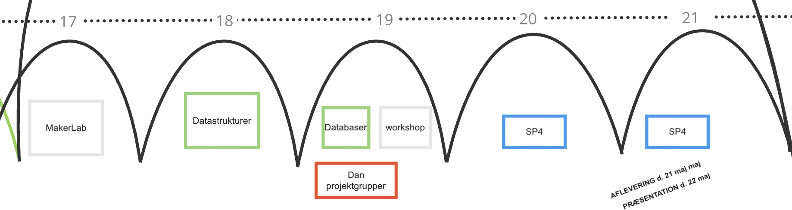

# Flow 4 - Teknologi og Innovation

I semesterets sidste del tager vi hul på teknologier der rækker ud over java programmet. Datastrukturer og databaser er fundamentet for
nærmest enhver teknisk løsning, helt uafhængigt af programmeringssprog. Data er ofte forudsætningen for at en softwareide kan blive til virkelighed,
Derfor får du indblik i teknologier til effektiv opbevaring af data, lige før I selv skal i gang med at realisere jeres egen ide. 
I flow'et vil der også være workshopdage hvor vi undersøger hvad der skal til, for at lave en grafisk brugergrænseflade eller anvende et eksternt API.

Vi slutter semesteret med ICE projektet ([SP4](../projects/SP4/)).
ICE står for Innovation, Creativity og Entrepreneurship, og betyder at I som udviklere også skal trænes i selv at formulere kravene til det system I koder._
I skal kunne tænke løsningen ind i en forretningssammenhæng og være med til at forme hvad der skal bygges.

 