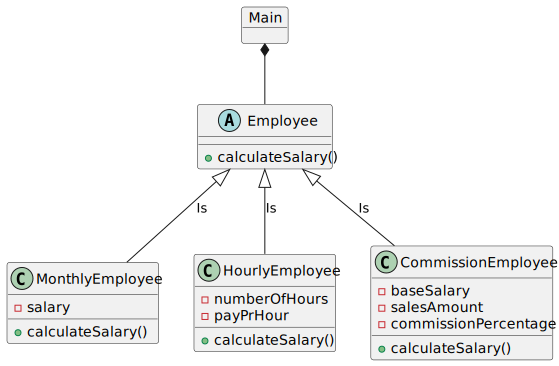

# 2. Lønberegning

Skriv et program, som beregner løn for medarbejdere.  
Du skal implementere klassehierarkiet herunder. 
Find selv på passende datatyper til de viste attributter, og tilføj passende konstruktorer til klasserne.





1. Employee med en abstrakt metode: calculateSalary(). Overvej parameter og returtype.

2. MonthlyEmployee, som repræsenterer en månedslønnet medarbejder. 
Klassen skal have en implementation af metoden calculateSalary(), som returnerer månedslønnen.


3. HourlyEmployee, som repræsenterer en timelønnet medarbejder.  
Klassen skal have en implementation af metoden calculateSalary(), som ganger antal timer med timeløn. 


4. Lav klassen CommissionEmployee, som repræsenterer en provisionslønnet medarbejder. Lad klassen nedarve Employee.
Klassen skal også have en implementation af metoden calculateSalary(): grundløn plus provision af medarbejderens salg:

**Eksempel:** _Grundløn 20000 kr. Salg 10000 kr. Provision 20% giver en løn på 22000kr._


5. Lav en klasse Main. 
   - Lav en metode main, hvori du instantierer en ArrayList af Employee-objekter. 
   - Opret et antal objekter af de tre klasser MonthlyEmployee, HourlyEmployee og CommissionEmployee og tilføj dem til listen. 
   - Kør listen igennem med et loop og udskriv løn for hvert enkelt objekt.

<div hidden>

```
@startuml salariesDiagram
object Main{

}
abstract class Employee{
+ calculateSalary(){abstract}
}
class MonthlyEmployee{
- salary
+ calculateSalary()
}


class HourlyEmployee{
- numberOfHours
- payPrHour
+ calculateSalary()
}
class CommissionEmployee{
-baseSalary
-salesAmount
-commissionPercentage
+ calculateSalary()
}
Main *-- Employee
Employee <|-- MonthlyEmployee: Is
Employee <|-- HourlyEmployee: Is
Employee <|-- CommissionEmployee: Is
@enduml
```
</div>


### Hvis du har tid...
- Tilføj relevante attributter og ikke-abstrakte metoder til Employee fx name, adress, department og lignende. 
- Lav justeringer i subklasserne, hvis det er nødvendigt. 
- Test i main, at metoderne virker for dine tre subklasser.
