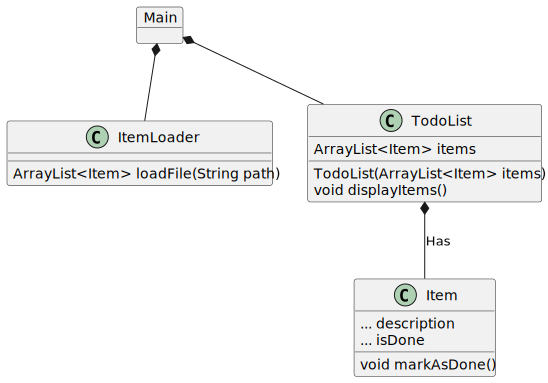

# 1. to-do liste
   I denne opgave skal du loade en to-do liste, dvs. en liste af opgaver (items), som skal repræsenteres i dit program som objekter. 
   Opgaverne skal vises til brugeren når programmet starter. 

1. Lav en csv fil med opgaver (items). Hver opgave skal stå på sin egen linje. Gem filen som “todo.csv”.
   Headeren skal have formen:
   `Description, Done`




2. Lav en klasse Item som repræsenterer en opgave i to-do listen.
   -  Tilføj attributterne jvf klassediagrammet. Bestem selv datatype og access modifyer for
   attributterne.

   - Giv klassen metoden markAsDone(), som registrerer at en opgave er udført.


3. Lav en ItemLoader klasse
   -  Tilføj metoden loadFile(), og lad den læse linjerne i filen. For hver linje laves et Item objekt og til sidst regturneres en ArrayList med alle Item-objekterne.
   

4. Lav en TodoList klasse
   - tilføj attributten items, og en konstruktor jvf. klassediagrammet. 
   - tilføj en metode displayItems() i TodoList, der printer alle items i listen ud.


5. Lav en Main klasse med en main-metode.
   - I main-metoden skal du instantiere ItemLoader
   - På itemLoader instansen skal du kalde loadFile. (Send stien til csv-filen med som argument) 
   - Sørg for at gemme listen, der bliver returneret fra metoden i en variabel. 
   - Instantier ToDoList med listen af Item-objekter som argument. 
   - Kald displayItems metoden i ToDoList, så du får printet alle opgaverne ud:

**_eksempel output_**

  ``` 
   1. Gøre rent i køkkenet, done
   2. Smøre madpakker, not done
   3. Vande blomster, not done
   4. Købe ind, done 
  ```

<div hidden>

```
@startuml todoDiagram
object Main{

}
class ItemLoader{
ArrayList<Item> loadFile(String path)
}
class TodoList{
ArrayList<Item> items
TodoList(ArrayList<Item> items)
void displayItems()
}
class Item{
... description
... isDone
void markAsDone()
}
TodoList *-- Item: Has
Main *-- ItemLoader
Main *-- TodoList
@enduml
```
</div>


6. Tilføj en metode, runDialog() til TodoList, med et while- loop hvori displayList bliver kaldt og derefter
  vises følgende besked:

```
 Tast et tal for den opgave du vil markere som 'done’
 Tast et tal som ikke findes i listen, hvis du vil tilføje en opgave
 Tast 0 eller et negativt tal for at afslutte
```

7. Skriv logikken til mindst én af kommandoerne:
-  Hvis brugeren fx.taster 2 skal det Item der står nummer 2 på listen sættes til 'done'
-  Hvis brugeren taster et tal på en opgave som allerede er done, skal opgaven fjernes fra listen.
-  Hvis man taster et positivt tal som ikke findes i listen, betyder det at brugeren vil tilføje en ny
  opgave til listen. Der skal derfor vises en besked om at skrive opgavens tekst. Den nye opgave skal
  blive til et nyt Item objekt og lægges ind i ArrayListen af items.
- Hvis man taster et tal som er 0 eller mindre, ryger man ud af loop’et og programmet stopper.
 