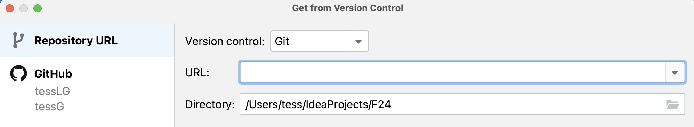
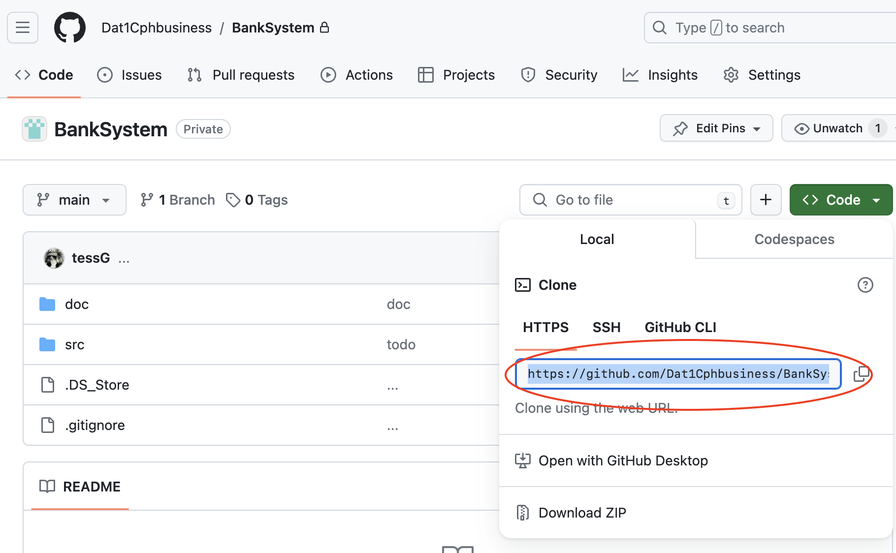

### Start et nyt projekt med kode fra et github repo

Man starter et projekt fra version control med "File > new > project from version control" kommandoen:

Du vil nu se dette vindue:

I URL feltet skal du skrive adressen til projektets repository på gitHub. Den finder du ved at trykke på den store grønne code knap på repository siden:

Nu skulle du gerne kunne se flg projekt filer:

