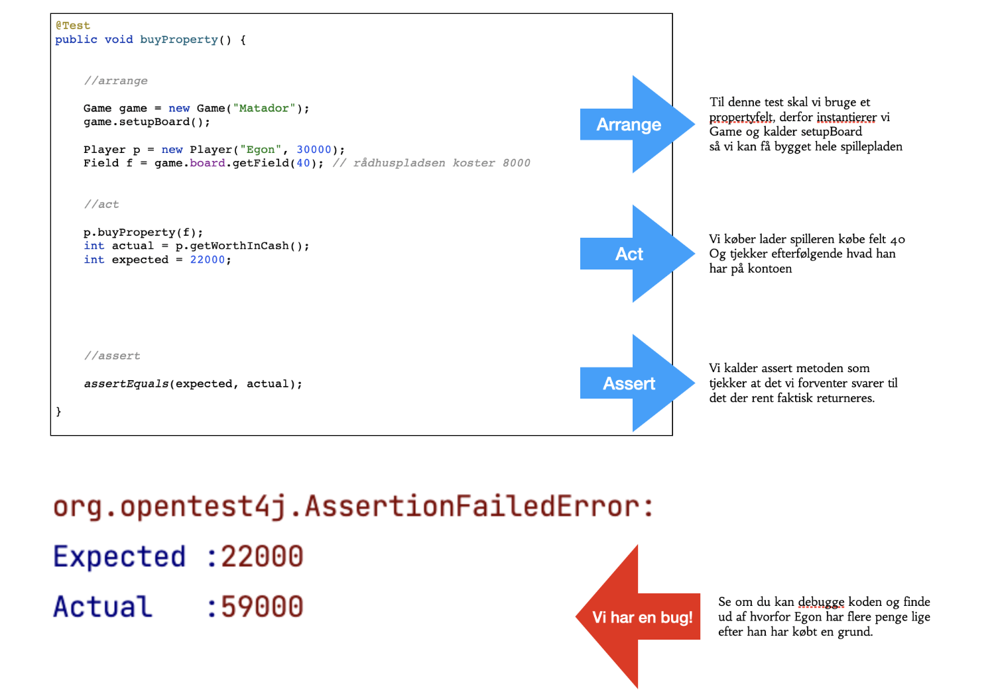

1. Opdater til den nyeste version af Matador - indeholder et fiks af det problem I vil se hvis I lader en spiller acceptere et købstilbud. (deeds listen i Player var ikke korrekt instantieret).
2. Der er også tilføjet en test af metoden buyProperty() i PlayerTest. Den er et meget godt eksempel på hvordan man kan teste en void metode, ved at undersøge tilstanden i stedet for returværdien (som jo i sagens natur vil mangle ved en void metode)
3. Testen viser også hvad vi kan gøre for at få en spilleplade lavet selvom vi er i testmode. Testkonsulenten Tine ville nok her indskyde at det gør testen mindre "unit"-agtig - da den afhænger af at alt muligt andet går godt. Men vi gør det lige indtil vi har lært en bedre metode. 
4. Testen jeg har tilføjet fejler, og det er fordi vi har en bug i koden. Se om du kan finde den inden vi mødes i morgen.
  
