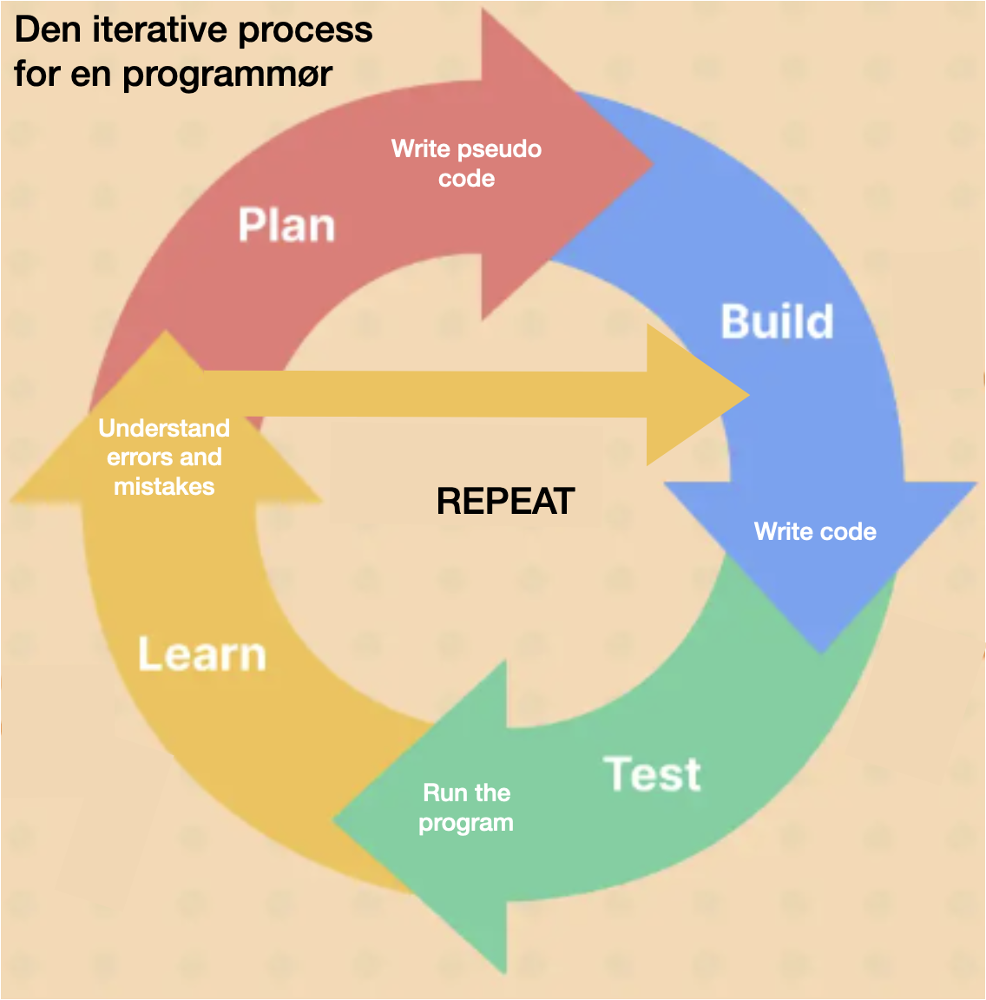

# SP1 - Skuffeprojektet
I første studypoint opgave demonstrerer du at du har fået styr det vi kalder byggeklodserne indenfor programmering. 

Opgaven laves i Processing, og afleveres lige inden vi går over til IntelliJ.

Vi kalder opgaven et "skuffeprojekt" fordi du arbejder på det i små ryk over længere tid (ca. 4 uger).


### Hvordan skal jeg arbejde med det? 
 - Start med projektet allerede fra 2. uge, hvor du prøver det af du har lært indtil nu.
 - Tag det op af skuffen en gang om ugen og lav lidt mere, eller lav noget om. Beslut dig for en fast dag hvor du vil arbejde på det og i hvor lang tid. 
Her er nogle forslag:
   - i et par timer lige umiddelbart efter lektionerne
   - om tirsdagen efter jeg har forberedt mig til onsdag, indtil jeg ikke kan mere.
   - i et par timer lige efter torsdagsopgaverne er afleveret
   - i et par timer om fredagen efter review.
 - Brug din tutor eller din lærer eller dine studiekammerater, hvis der er noget der driller. Spørg om de lige gider kigge på det, så du kan komme videre og ikke sidder fast for længe med et glemt semikolon ;)
 - Hver gang du arbejder på de, så skriv bagefter ned hvad du har ændret som en kommentar i toppen af koden. fx

```java
// 17.februar: 
//  - Erstattet alle hardcodede værdier med globale variable. 
//  - Ændret scope og navngivning på nogle variable
```

### Læringsmål
Opgaven hjælper dig med at opnå disse mål:
 - forstå variable, datatyper, betingelser, loops, funktioner, objekter, lister og hvordan man sætter det hele sammen.
- forstå "how to kill you darlings": Du vil komme til at skrotte kode som du med stort besvær har skrevet, fordi du nu har fundet en meget smartere måde at gøre det samme på.
- forstå at programmer bliver til i en iterativ process:
   

Din løsning skal demonstrere at du har opnået målene.


## Hvad er opgaven?
Opgaven går ud på at skabe dette billede i Processing. Det kan laves på mange måder, afhængig af hvad du har i din værktøjskasse.
Herunder har vi ordnet nogle forslag til hvad du hver uge kan gøre for at udvide eller forbedre din kode


_Det er ikke tilladt at loade hele grafikken ;) Men du må gerne loade hvert enkelt flag._


Herunder ser du forslag til ting du kan overveje, efterhånden som du lærer nyt:

## Uge 1

### Intro til Processing
Allerede efter første lektion, vil du være i stand til at tegne de hvide rektangler der danner baggrund for landenavne.
Når du placerer elementerne, træner du din forståelse af Processings tegnefunktionerne, deres parametre og hvordan de påvirker placeringen af primitive "shapes" i Processing vinduet.

### Variable
Hvad har vi af data i billedet? Hvilke variable skal jeg lave for at holde på den data? Et par eksempler:
- Højde og bredde på de hvide rectangler. Her kan du evt. bruge systemvariable som ```width``` og ```height```, til at arbejde med dimensioner og placering af rektanglerne
- Hvad med teksten til at skrive landene?
[Brug the Processing reference!](https://processing.org/reference/text_.html)
-  Hvad med billeder? 
[Brug the Processing reference!](https://processing.org/reference/loadImage_.html)

## Uge 2: Kontrolstrukturer

### Betingelser
-  Er der noget i billedet der på systematisk vis varierer?
 - Kan du skrive en betingelse der tager hånd om den variation?

### Loops
Er der kommandoer der bliver gentaget mange gange? (mere end 1 betyder "mange" i programmering).
- Analyser hver der konkret sker i hver gentagelse
- Er dét der sker, betinget af noget?
- Hvor mange gentagelser er der tale om? hvornår skal det stoppe?

Ofte er det en god ide at skrive en pseudokode når man skal bygge denne slags kode.

## Uge 3: Organisering af koden
### Funktioner
Hvor meget gentager du dig selv i koden? Er din kode læselig?
 - kan du gruppere visse kommandoer i en funktion og kalde funktionen i stedet?
Det er svært at læse en masse linjer med kommandoer. Din kode bliver mere læselig hvis den brudt op i mindre bidder.
Modulariteten giver dig også mulighed for at genbruge kode. Hvis du opdager at du bygger funktioenr der ligner hinanden 
bortset fra en enkelt lille detalje: overvej om du kan nøjes med en en funktion og give den et eller flere parametre. 

### Objekter og klasser
Hvilke objekter er der i dette billede?
Du ser måske at der er **grupper** bestående af nogle **lande**.
- start to nye klasser: Group og Country
- beskriv evt. de to ting i almindelig text før du fortsætter med at skrive klasserne.
- Hvad er forholdet mellem de to klasser?
- Hvilke felter skal de hver især have?
- Kan du give Country en metode der sørger for at vise "et land" på skærmen?
- Hvor skal metoden kaldes fra? Fra konstruktoren? Fra setup()?
- Hvorfra vil du instantiere Country og group?

## Uge 4: Lister
Nu hvor du har lært om lister som noget der kan holde en bestemt datatype, hvad så med at tilføje en liste med typen Country til Group?


## Jeg har gjort det hele, men der er stadig masser af tid, hvad så?
Er du der hvor du har overvejent alle de spørgsmål ovenover, så ser din kode sandsynligvis ret fornuftig ud nu.
Du kan fortsætte med at fylde på med diverse features og lækkerier. Her er et par ideer:
- Kan du tænke animation ind i billedet? Hvad med at gøre noget klikbart?
- Kan du genbruge koden til et helt andet projekt, som fx. til visning af grupperne i en bordfodboldturnering her på skolen?
- Kan du med en mindre ændring i koden, lave det om til en helt anden type projekt?

Vær kreativ - der er ingen regler. 

