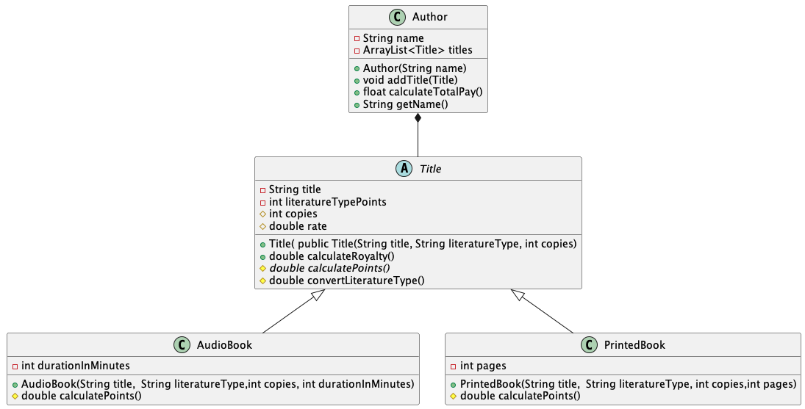
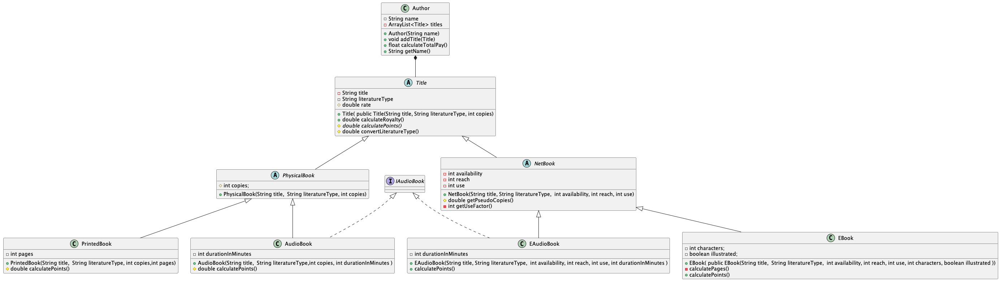

# SP2 Bibliotekspenge

En forfatter modtager årligt bibliotekspenge for at have sine bøger (titler) stående på de danske biblioteker. Hvad en titel præcis indbringer af hænger af dens type.
Der skelnes f.eks. mellem printede bøger og lydbøger. Byg et system der beregner en forfatters bibliotekspenge, baseret på forfatterens titler.

Til hjælp har du klassediagrammet nederst. Implementer klasserne med de angivne metoder, felter og relationer. 
Implementer dernæst metoderne udfra flg. beskrivelse af reglerne for beregning.

## Test
For at teste systemet, skal du lave en klasse kaldet `LibraryRoyalityCalculator` som ikke er med i klassediagrammet. 
Den har en main metode, hvori du opretter mindst 1 forfatter med mindst 1 lydbog og mindst 1 printet bog.
Brug Author klassens `addTitle` metode til at tilføje titlerne til forfatteren. 
Kald forfatterens `calculateTotalPay` der gennemløber listen af titler, og for hver titel, igangsætter beregning af bibliotekspenge(royalties), lægger tallene sammen og returnerer beløbet med 2 decimaler.

Fra `main` skrives resultatet pænt ud med forfatterens navn og det beløb der skal udbetales, fx:

`Olga Ravn: 4213.64kr`

## Beregning af point:
For at beregne bibliotekspenge for en titel, må man først beregne titlens “point”.
Point beregnes ved at gange antallet af sider/minutter med titlens litterturtype og antal eksemplarer.

Litteraturtypen kan være en af følgende:"BI", "TE", "LYRIK", "SKØN", "FAG" og konverteres til en talværdi efter flg. skema:

|Litteraturtype | Værdi|
|---|---|
|Billedbøger (for børn) (BI)	| 3|
|Tegneserier (TE) | 	3|
|Lyriksamlinger (LYRIK) | 	6|
|Skønlitterære bøger  (SKØN) | 	1,7|
|Fagbøger (FAG) | 	1|

Det tal man får når man udregner titlens point, skal ganges med den aktuelle rate for biblioteksbøger.

| Formel | _point x rate_|
|-------| ---|
|||

Raten for en titel ligger i 2025 på **0.067574 kr.**

#### Eksempel:
Forfatteren Olga Ravn har bogen “Celestine” både som print og som lydbog.
Den printede bog findes i 140 eksemplarer og er på 166 sider
Audiobogen findes i 140 eksemplarer med en varighed på 3 timer og 12 minutter

Ved den printede bog ser beregningen således ud:

|Formel | _Sider x  litteraturtype x eksemplarer_|
|--- | ---|
|Eksempel | _(166)  x 1,7  x 140  = **39508 point**|

Er der tale om en lydbog (AudioBook) -  ser beregningen lidt anderledes ud:

| Formel | _(varighed i minutter x 0.5) x litteraturtype x eksemplarer_|
|---| ---|
| Eksempel | (192/2)  x  1,7  x  140  = **22848 point**)|

Resulatet er forfatterens udbetaling. For Olga Ravns to titler:

_39508 x 0,067574 + 22848 x 0,067574 = 4213.64_ (afrundet med 2 decimaler)

## Design
I klassediagrammet herunder ses at metoderne  `calculateRoyalties()` og `convertLiteratureTypePoints()`, 
implementeres i superklassen (`Title`), mens metoden `calculatePoints()` er abstrakt og altså skal implementeres forskelligt i de to subklasser.

#### Variabelnavne oversættelse
 - **sider:** pages
 - **minutter:** durationInMinutes
 - **litteraturtype:** literatureType
 - **exemplarer:** copies

## Frivilig fortsættelse - udvid med netbaserede bøger

I biblioteksverdenen findes to yderligere kategorier af titler: fysiske titler (printede bøger og lydbøger) og netbaserede titler (e-bøger og e-lydbøger) .

Forskellen på de to er at netbaserede titler ikke har eksemplarer men i stedet opererer med

 - **Udbredelse (reach):**               antal kommuner, der har udlånt bogen
 - **Tilgængelighed (availability):** antal kommuner, der har bogen til udlån
 - **Anvendelsesfaktor (use):**      antal udlån

Beregning af point for netbaserede bøger:

En forfatter til en ikke-illustreret fagbog med 360.000 karakterer stiller, bogen til rådighed på eReolen (EBook). 
Den kan lånes i alle 97 kommuner(tilgængelighed), men er kun blevet udlånt i 50 af kommunerne (udbredelse), og har en anvendelsesfaktor på 205.

Forfatteren vil få følgende antal point for værket:

| Formel | _Beregnede sider x litteraturtype x ((udbredelse x 5) + tilgængelighed x 0,5)+ anvevendelsesfaktor |
| ---| --- |
| Eksempel | _220 sider x 1 x ((97  x 0,5) + (50 x 5) + 205))_ = **98.670 point** |

Sider beregnes (pseudosider) således: 

_Antal karakterer/1800 + 20_ 

Hvis bogen er illustreret lægges der 10% til dette tal.

Ved netbaserede lydbøger(`EAudioBook`) bruges samme formel, bortset fra at pseudosider erstattes med titlens varighed/2.

Designet ser nu således ud:

- [Aflevering](https://cphbusiness.mrooms.net/mod/assign/view.php?id=766002)