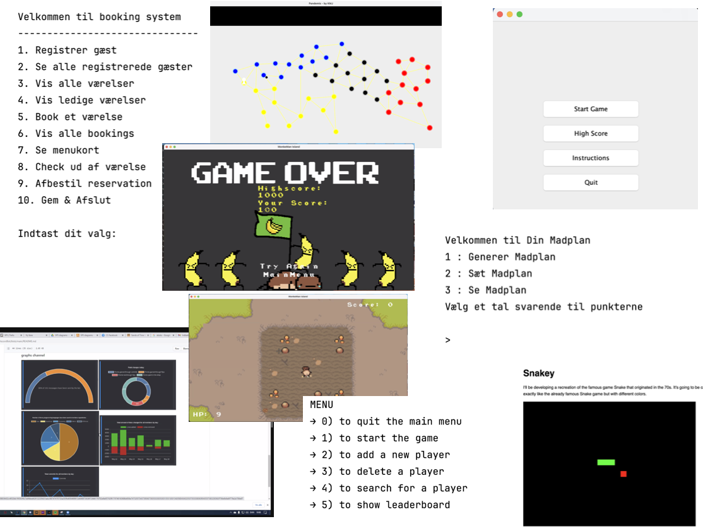

# SP4: ICE 
ICE står for Innovation, Creativity og Entrepreneurship. I ICE projektekt skal I kode et system I selv bestemmer omfang og indhold af. I skal selv identificere et ægte problem som jeres applikation adresserer. I sørger for selv for at stille opgaven så den udfordrer lige der hvor I er.

ICE projektet giver 40 study points, og er dermed afgørende for at man kan blive indstillet til eksamen. For at få opgaven godkendt, er det et absolut krav at man er tilstede til at præsentere sit projekt.
Kan du ikke være der, skal du have en særlig grund og lave en aftale med en underviser om at få godkendt projektet på en anden måde.

## Hvad skal vi kode?
Det kan godt være en udfordring at finde på et godt projekt, når man pludselig er fri til selv at vælge hvad man vil lave. Her er 2 gyldne fifs:

1. Tænk stort! Eller i hvertfald ikke for småt. I må gerne designe og udtænke en større løsning end hvad man kan nå at implementere. Så vælger I bare en del af det som I så koder.

2. Lad jer guide af jeres egne interesser, noget I synes kunne være sjovt at lave eller måske noget I synes mangler at blive lavet, eller noget I ville ønske I havde lavet som I vil prøve at gøre efter. 

Her er eksempler på hvad tidligere studerende har lavet:
 
- Memory spil med audio (til børnehavebørn)
- Dungeon crawler spil (tekstbaseret adventure game
- Yatzy
- Vending machine (fx. til køb af sodavand)
- FoodPlanner (generering af indkøbsliste på baggrund af valgt menu)
- Wardrobe management systm
- Visualisering af data fra et gitHub repository
- Shop til indkøb af tekstiler
- Hotelmanagement applikation
- Co2 beregner
- Billetsystem til garderobe på en klub
- Quiz

# Køreplan for ICE projekt

**1. Skriv de funktionelle krav**

De funktionelle krav beskriver overordnet hvad systemet skal kunne - ikke hvordan. Skriv det fra et perspektiv hvor I ikke ved noget om hvordan det skal løses, men kun hvad det er brugeren ønsker systemet skal kunne.
Det er her domænet gøres klart - dets entiteter (dette kan være ting, personer, services). Vigtige regler og relationer mellem entiteterne beskrives også.
Beskrivelsen skal fylde ca. 1 A4 side, og vedlægges opgaven fx. som en README.md fil. 

**2. Foretag en objektanalyse**

Find navneordene i de funktionelle krav og sæt dem i en liste. Gennemgå ordene en for en og overvej om I tror det kan blive til en klasse i systemet. Måske er der tale om et attribut? Måske er det et synonym for et anden ord i listen.
De entiteter som I gerne vil gå videre med, skal I oversætte til engelsk.
Beskriv hvad hvert af disse ord betyder - en klar definition.

Det er her I grundlægger et fælles sprog og en fælles forståelse for jeres kode.

**3. Tegn en domænemodel**

Tegn domænemodellen, først i hånden og rentegn i plantUML. 
Undlad at smide klasser ind som ikke er en del af domænet. fx. TextUI. 
En domænemodel skal kunne forstås af din mormor.

**4. Klassediagram**

Tag fat i domænemodellen og gør den mere teknisk så det bliver til et klassediagram - I planlægger hvad der skal være af attributter og metoder på hver enkelt klasse. Måske beslutter I om vil bruge en database, et framework.
   I kan ikke nå frem til en gylden plan, men ved at gøre dette, får I snakket jer mere ind på hvordan denne kode skal bygges. Nu må I gerne indtænke de mere tekniske klasser som skal tage sig af ting som data og brugerinput.

**5. Project setup**

Sørg for at I har et repository til projektet på GitHub, hvis det ikke allerede er på plads.
Overvej om I vil oprette et GitHub Project, til at holde styr på hvem der laver hvad.

**6. Stub kode**

Begynd at kode et klasse-skelet med stub kode op. Klassediagrammet skal godkendes af en underviser ved første vejledningsmøde. 
Dette er både for at sikre at I har fået defineret en opgave som har nok kød på og at I får øvet jer på de ting vi har arbejdet med i dette semester.

**7. Implementer**

Hvis I har bygget et godt fundament ved at følge de forrige trin, bliver det nemt at bygge kernefunktionalitet og tilføje så mange features som I kan nå.

## Aflevering

Afleveringen skal indeholde flg:

1. Koden (github repo)

2. De funktionelle krav (ca. 1 A4 side, placeres i projektet som README.md fil)

3. Design og analyse dokumenter (placeres i projektet i en 'doc' folder)

## Præsentation
Deltagelse ved præsentationen er påkrævet for at få studypoints for opgaven.

Disposition til Præsentationen
- Helikopter perspektivet:
  Formålet med det hele. Konteksten. Hvad handler projektet om? Hvad er det for en type applikation?

- Resultatet:
  Hvad fik vi bygget? Og her er vi andre både interesseret i den (muligvis kun delvis) kørende kode, og hvordan den er skruet sammen. Kan I give os et overblik over applikationen?

- Erfaringer og reflektioner:
  Hvad har I lært? Om teknologien og om udviklingsprocessen. Værktøjer, metoder, biblioteker, kode emner som har haft betydning
